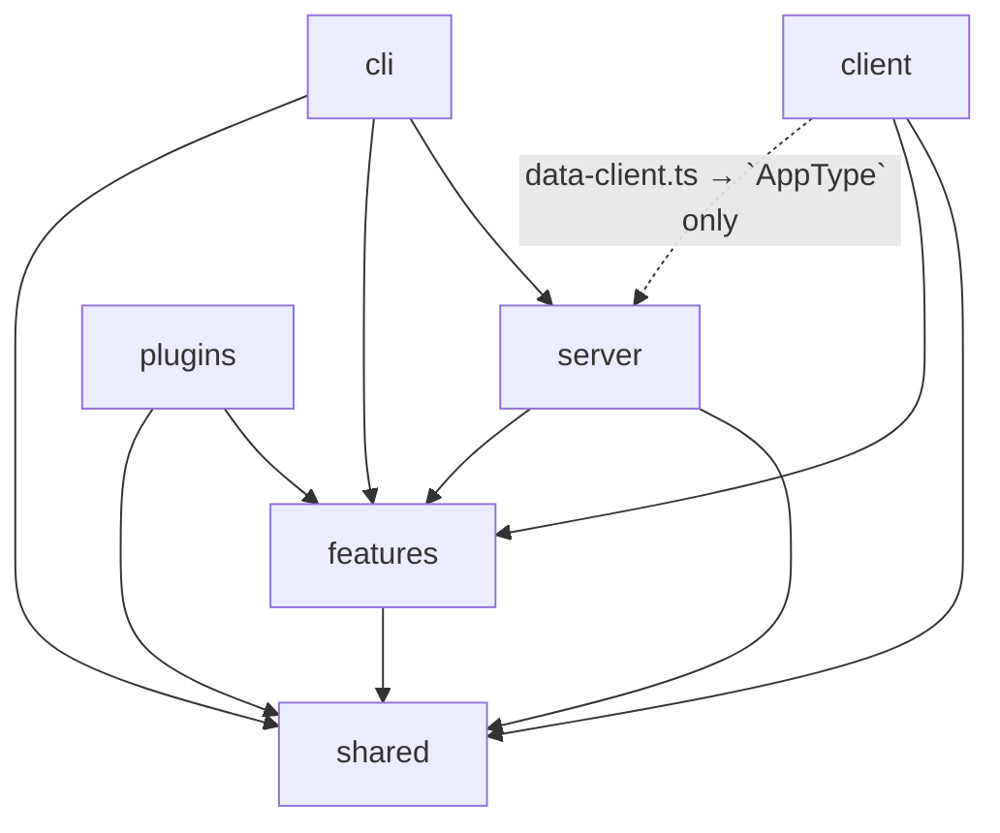
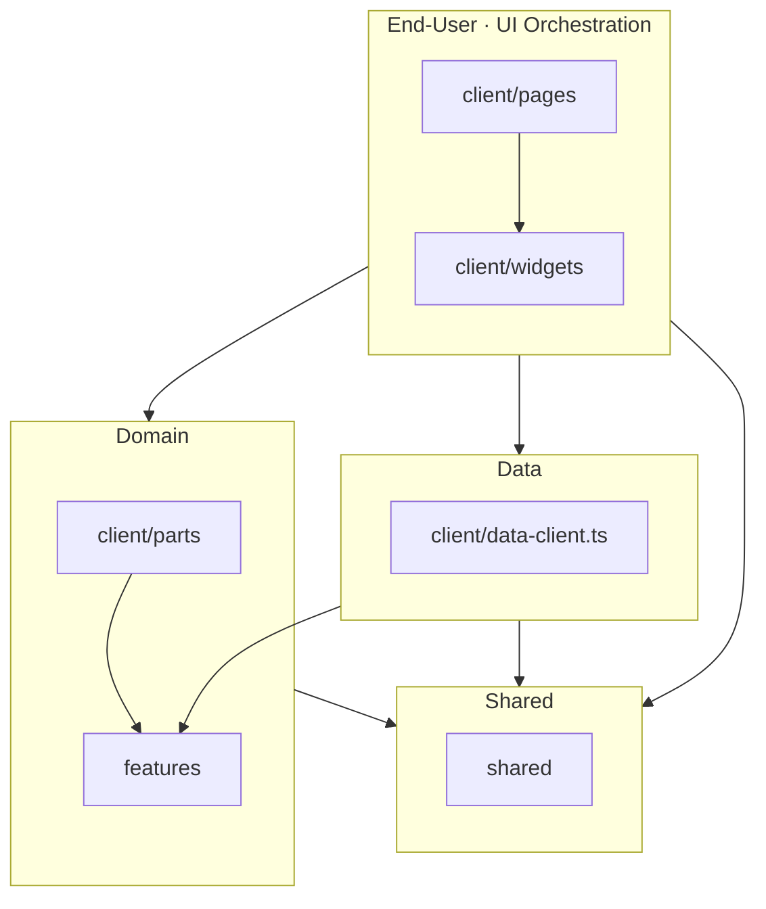

# Architecture — Layers and Dependency Boundaries

## Directory Structure

```text
src/
  client/
    pages/          # Screen-level UI flow, data access, and state synchronization
    widgets/        # Composition and behavior of self-contained feature UIs
    parts/          # Domain-aware UI that presents supplied data and actions
    data-client.ts  # Server communication boundary consumed by the frontend
  server/           # HTTP handling, file storage access, and server-side orchestration

  plugins/          # Generator implementations and authoring instructions
  cli/              # Command-line input handling and execution orchestration

  features/         # Domain contracts and rule implementations independent of UI and external I/O

  shared/           # Code independent of application context
    universal/      # Runtime-independent common code
    node/           # Common code for the Node.js runtime
    react/          # Common React code unaware of application policy
    react-ui/       # General-purpose UI driven by supplied data and actions
    react-flow/     # React Flow presentation elements unaware of application policy
```

## Dependency Rules

The diagrams and rules below describe permitted import directions between modules in this repository. Arrows do not represent HTTP/SSE communication flows, and an edge between directories does not permit all imports between their nested modules.

### Top-Level Directories



### Frontend



### Responsibilities and Constraints

- Imports between modules in the same layer must still respect each module's responsibilities. Circular dependencies are not allowed. Unless an exception is explicitly documented, the same dependency boundaries apply to type-only imports.
- The default UI dependency direction is `pages → widgets → parts → shared`. Higher-level modules may import lower-level modules directly, but reverse imports are not allowed. Cross-page imports are also prohibited.
- `features` owns domain schemas, types, and Domain Logic. Business Rules are the product's policies, conditions, constraints, and calculation methods; Domain Logic is the code that implements them independently of the UI. This layer does not handle rendering, UI flow orchestration, browser interactions, or network and file I/O. Do not place code in `features` merely because it is a pure function or is written in a `.ts` file rather than a `.tsx` file.
- `parts` is a domain-aware presentation layer and, unlike `features`, may compose UI. Code coupled to the state, behavior, or presentation of components in `pages`, `widgets`, or `parts` is classified as Presentation Logic.
- Code in `shared` must not have direct knowledge of higher-layer application policies, API contracts, global state, or execution flows. Consumers supply the data and policies it needs. General-purpose UI presentation and interactions are UI Logic, a subset of Presentation Logic, and do not encode product-specific requirements. Names, reuse counts, function purity, or potential reuse alone do not justify placing code in `shared`.
- React-related modules within `shared` follow the dependency direction `react-flow → react-ui → react → ...`.
- `data-client.ts` is the communication boundary between the frontend and the server, treating the server API as an external contract. Oxlint rules prohibit importing server runtime code. A type-only import of the server's `AppType` is allowed as an exception for sharing the RPC contract.
- `pages` and `widgets` may execute operations exposed by `data-client.ts`. The caller coordinates screen state and UI flow based on the results. In contrast, `parts` and `features` must not import `data-client.ts` directly. When domain contracts are needed, use the schemas and types in `features`.
- `plugins` contains source packages for generators that agents discover, select, and use. Each generator declares its identifier, description, and usage instructions in `GENERATOR.md` and may also provide code for source analysis, graph generation, and CLI execution. Neither `client` nor `server` imports and executes this code. Agents follow the instructions and run generator commands as needed. Generator code is bundled separately from the client and server.
- Detailed import permissions are defined in `boundaryLayers` in `oxlint.config.ts` and enforced by `eslint-plugin-boundaries` through Oxlint.
